# Introduction

Physics in application is practically limitless. Well, it is because it is from real life, as per what is called a **natural science** of its core. And in such study, observation is one of the most important thing of investigation. 

What we have seen in the history of experimental and observational physics tell us that experiment sometimes has to be passive or indirect - using specific factors to study the system rather than intuitively "looks" of it. Fundamentally, quantification and discrete analysis requires something more than just that - a proxy of which measurement can be conducted [^3]. In many cases, for example, catalysis, this is attributed to a technique called spectroscopy, or "investigation by light".

[^3]: In fact, mass is an **operational quantity**, which means it is usually measured of certain proxy or property, then defined as such. Granted, Higgs boson and else give explanation to such by attribute it to a particle, but even in such explanation, what even gives Higgs boson being the boson?

In such sense, let us investigate, for now, the potency and what are there of spectroscopy, under two fundamental landscape (with the focus on the other one per usual) - *vibrational spectroscopy*, and *energy-level spectroscopy*, which use two different interpretation of the event happening in a material interaction using spectroscopic technique. 

___

As we all know, lights is a weird object. Inconsistent as it is, we can only observe it using two models: *wave* and *particle*, even so on quantum scale. And both of them offers us different way to model the two main type of interpretation of Raman scattering effect: *vibrational model* and *energy level transition* model. 

# The subject's mechanics

According to quantum mechanics, everything is *quantized*. That means even their state of energy is also quantized into $n$ levels, which can then be specified. Because of **such** quantization, electrons and photons has the same kind of energy level that is available to them, only in interaction with matters. For processes, ideally blackbody radiation, hot object emit photons of all energy, not just $E=hf$. The probability of the energy spectrum, defined on $[0,\infty)$ is governed by **Planck's black-body radiation law**, 

$$
B(\nu,T)=\frac{2h\nu^{3}}{c^{2}} \frac{1}{hv/ek_{B}T - 1}
$$

where $B$ is the spectral radiance of the black-body, $\nu$ the frequency, $T$ the absolute temperature, $k_{B}$ as the *Boltzmann constant*, and $c, h$ are Planck and speed of light in the medium constants respectively. Using such law, we obtain the famous curve of black-body radiation that was used to refute the ultraviolet catastrophe. 

It is only when interactions with matters and else that photon itself exhibits quantization and transitioning periods. Our interest lies in the structure of such interaction, with respect to a particular phenomenon between light and matter - *scattering*, or absorption-diffraction (still interacting, but more specifically internally interactive). Or more specifically, **Raman scattering** effect, and what also constitute different effects of IR (infrared) spectroscopy. [^4]

[^4]: Specifically of scattering effects, there are a lot of them. For example, see [Brillouin scattering](https://en.wikipedia.org/wiki/Brillouin_scattering), [Compton scattering](https://en.wikipedia.org/wiki/Compton_scattering), [Mie scattering](https://en.wikipedia.org/wiki/Mie_scattering), and [Rayleigh scattering](https://en.wikipedia.org/wiki/Rayleigh_scattering). As a fairly abnormal and not so well-known subset, see [Mössbauer effect (fluorescence)](https://en.wikipedia.org/wiki/M%C3%B6ssbauer_effect) for comparison of events. 

## Molecular spectra
Photon can be said to be an electromagnetic radiation travelling in a specific way. The electric field strength $E$ at a given time $t$ is expressed by $E=E_{0}\cos{(2\pi vt)}$, where $E_{0}$ is the amplitude and $v$ is the frequency of radiation. 

The distance between two points of the same phase in successive waves is called the "wavelength", $\lambda$, which is measured in units such as **angstrom**, nanometre $(nm)$, millimicron $(m\mu)$ , or centimetre $(cm)$. The *frequency*, is the number of waves in the distance light travels in one second, hence,

$$v=\frac{c}{\lambda}$$

where $c$ is the velocity of light ($3\times_{1}0^{10}\mathrm{cm/s}$). Usually, in vibrational spectroscopy, we use the *wavenumber*, $\tilde{v}$, defined by 

$$\tilde{v}=\frac{v}{c}$$

The difference between $v$ and $\tilde{v}$ is obvious, the dimension is different of $1/L$, or, in centimetre, is $(1/s)(cm/s)$ or $1/cm$. Thence, 

$$\tilde{v}=\frac{v}{c}=\frac{1}{\lambda}(\mathrm{cm}^{-1})$$

As shown, the wavenumber $\tilde{v}$ and frequency $v$ are different parameters, yet are often used interchangeably. Thus, an expression such as frequency shift of $30\mathrm{cm}^{-1}$ is used conventionally by IR and Raman spectroscopists. 

If a molecule interacts with an electromagnetic field, a **transfer** of energy from the field to the molecule can occur if only when Bohr's frequency condition is satisfied. Namely, 
$$\Delta E=hv=h \frac{c}{\lambda}=hc \tilde{v}$$

Here, *quantization* is in effect, and $\Delta E$ is the difference in energy between two quantized states, $h$ is the Planck constant $(6.62\times 10^{-27}\mathrm{ergs\:s})$. Thus, $\tilde{v}$ is directly proportional to the energy of transition. As we then also see, other frequencies in the blackbody's radiation would not trigger such transfer process, and either is absorbed in to the background radiation, or is entirely skipped, or, in wave mechanics, absorbed or destructed. Suppose that 

$$
\Delta E=E_{2}-E_{1}
$$

where $E_{2}$ and $E_{1}$ are the energies of the excited and ground states, respectively. Then, the molecule absorbs $\Delta E$ when it is excited from $E_{1}$ to $E_{2}$, and emits $\Delta E$ when it reverts from $E_{2}$ to $E_{1}$. Another effect can happen is *radiationless transition*, for example, when a molecule loses $\Delta E$ via molecular collision. 

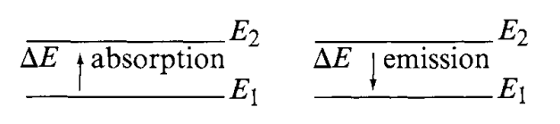

Using the above relationship, we can write 

$$
\Delta E=E_{2}-E_{1}=hc \tilde{v}
$$

The magnitude of $\Delta E$ is different depending upon the origin of the transition. We are mainly concerned with the mechanics of Raman and IR spectra, and hence would see them in the range of $10^{4}\sim 10^{2}\mathrm{cm}^{-1}$ region. They would originate from vibrations of nuclei constituting the molecule, hence, you would also see analysis with molecules in them, and not atoms. Lastly, we would want to mention that, or recall, if you are familiar with it, that Raman phenomenon is very much related to both *electronic transition* and *vibrational states*, and hence, *vibrational mechanics* of inter-molecular behaviours. 

## Vibration and Diatomic vibration

In general, matters at the molecular scale do indeed, vibrate. In general, **vibration** is defined to be the mechanical phenomenon whereby oscillations occur about the equilibrium point, and is inherently a classical phenomenon. [^1]. And more of such, is that in general, vibration act is considered of system from two (diatomic) or more molecules. 

Consider the vibration of a diatomic molecule in which two atoms are connected by a chemical bond. We assume the interaction and energy transition from internal and external environment of the system causes perturbation to the equilibrium state of the molecular structure. Then, we have two explanation of the classical and quantum mechanical way. For the classical case, the assumption is that the equilibrium-based mechanics obeys Hooke's law for the chemical bond, hence giving us the equation of motion and total energy $E$ as

$$
\begin{align}
q &= q_{0} \sin\left(2\pi v_{0}t + \varphi\right) \\
  &= q_{0} \sin\left[2\pi \left( \frac{1}{2\pi} \sqrt{\frac{K}{\mu}} \right) t + \varphi\right]
\end{align}
, \quad \quad E = 2\pi^{2}v_{0}^{2}\mu q_{0}^{2}
$$

for $q$ the displacement, $\mu=m_1 m_2/ (m_1 + m_2)$ the reduce mass, $q_0$ the maximum displacement, $\varphi$ as phase constant, and $v_{0}$ being the classical vibrational frequency. The vibrational pattern results in the potential energy diagram similar to a harmonic oscillator. 

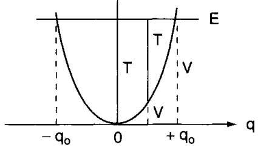

For quantum mechanics, the problem is akin to solving the Schrödinger equation of potential: 

$$
\frac{d^{2}\psi}{dq^{2}} + \frac{8\pi^{2}\mu}{h^{2}} \left( E - \frac{1}{2}Kq^{2}\right) \psi = 0
$$

Which gives us the following set of eigenvalues (energy) and eigenfunctions: 
$$
E_{v} = hv \left(v+ \frac{1}{2}\right)= h c \tilde{v}\left(v+ \frac{1}{2}\right), \quad \psi_v = \frac{\left( \alpha / \pi \right)^{1/4}}{\sqrt{2^v \, v!}} \, e^{-\alpha q^2 / 2} \, H_v\left( \sqrt{\alpha} \, q \right)
$$

where $H_{\alpha}$ is a Hermite polynomial of the $v$th degree. [^2]

[^2]: The use of Hermite polynomial is fairly classic of an approximation. Other types of polynomial can be used, for example, the [Chebyshev polynomial](https://en.wikipedia.org/wiki/Chebyshev_polynomials) for sine-like periodic system. 

What can we say about those results? The quantum mechanical frequency and classical frequency, which is fairly different from each other, even though they are the same in frequency and such, relies on several key treatments. 

First, the classical treatment treat $E=0$ when $q$ is zero, while quantum mechanics treat at that point $E=1/2hv$ (zero point energy). Secondly, the energy of such a vibrator can change continuously in classical mechanics, of which we have been discussed in the continuity problem of photonic subject. In quantum mechanics, the energy change of such system can only be in range of $hv$ quantization, which is reasonable considering our assumption of inter-molecular interaction filtering. Thirdly, the vibration is confined within the parabola in classical mechanics, however, in quantum mechanics such can be absent, for the tunnel effect to potentially exists in practice. 

Furthermore, $hv$ is an idealization. In practice, atomic molecular potential different is approximated by the **Morse potential** function, which is 

$$
V = D_{e}(1-e^{-\beta q})^{2}
$$

Here, $D_{e}$ is the dissociation energy and $\beta$ is a measure of the curvature at the bottom of the potential well. If the Schrödinger equation is solved with this potential, the eigenvalues are then 

$$
E_{v} = hc\omega_{e} \left( v+\frac{1}{2} \right) -  hc\mathcal{X}_{e}\omega_{e} \left( v+\frac{1}{2} \right)^{2} + \dots 
$$

where $\omega_{e}$ is the wavenumber corrected for anharmonicity, and $\mathcal{X}_{e}\omega_{e}$ indicates the magnitude of anharmonicity. 

According to quantum mechanics, in addition, we would most likely see transition involving $\Delta \nu = \pm 1$, but not usually $\Delta \nu = \pm n$ for $n\neq 1$, for $\nu$ the energy level. Coincidentally, such transition appears most strongly both in IR and Raman spectra. This is expected from the Maxwell-Boltzmann distribution, which state the population for $\nu=1,\nu =0$ state as 

$$
\frac{P_{\nu=1}}{P_{\nu=0}} = \exp{(-\Delta E /kT)}
$$

::: {.callout-note}

## Mechanics of transitioning actions

Usually, in multi-atom system, chemical bonds are what that provides the molecular structure. Chemical bond is an **attraction force** between atoms or molecules, which allows for the formation of chemical compounds. 

Transitions then typically, will consists of factors such as the bond strength (for example, I-bond versus II-bond would be a contributing factor), bond length being the average distance between nuclei of two bonded atoms in pair. Vibrational motion and hence spectroscopic actions and then is based on the below-threshold of dissociation - which unlink such bond, to perturb the system by hitting it with energy. This energy excites the molecule, causing strains and pull, and hence vibrational patterns. 

On the other side of it, vibrational modes, which will be discussed later on, also relies on the topological ontology of the system, such is to say that the polarization, electronic configuration of the bonding system and molecular properties affect the vibrational shape of such molecule, hence the signature that it exhibits. 
:::

# Theory of spectroscopy

The following section then will dive into the main theory of spectroscopy, in a sense. Specifically however, most of its content would be left of dealing with Raman and IR spectroscopy, *mainly* because we are indeed dealing with them and not the other that much. And further down the road for them being the more practical, higher scale, much better ergonomic subjectively, and perhaps important of all easier to interpret, to a given sense. Nevertheless, again, justifying different spectroscopic effects, and their subsequent spectroscopy, would be one of our main concern. 

## Governing different spectroscopic behaviours

Let us now turn our attention to the spectroscopic system that we will be considering of. By default, spectroscopy's definition is fairly broad - it basically indicts on the action of lights acting on matter and observation thereof that can then be extracted from such. Using such analysis, we can deduce a variety of properties, including its electronic, vibrational, rotational, electronic and nuclear spin states and energies. Those then can be deduced again, to explain fundamental phenomena, for example, IR absorption behaviours [^5]. 

[^5]: See [here](https://ocw.mit.edu/courses/5-35-introduction-to-experimental-chemistry-fall-2012/3f54ecef6f159a0a11dd60251491e075_MIT5_35F12_Mod1_Background.pdf)

Before we go further, let us really dig into what those mean, and what can then be said to constitute the *energy* and *state* of the system. Because we are taking the approach of shining light, which is of pure energy, into matter, the copulative subjects that is connected will be the change in energy, and what then constitutes the change of state for a given state space, at least according to quantum mechanical interpretation of physical events in microscopic scale. 

The **energy system** of molecules or matters can be said to be separated into *sub-systems*. Each subsystem contributes to the total energy, 

$$
E_{\text{total}} = E_{\text{electronic}} + E_{\text{vibration}} + E_{\text{rotation}} + E_{\text{e spin orientation}} + E_{\text{nuclear spin orientation}} + E_{\text{translation}} + \epsilon 
$$

where $\epsilon$ is a kind of noisy contribution of negligible effects. Using such energy model, we can then effectively probe it for energy transition system observed for a particular subject. 

Each of those effects are fairly fundamental, but can almost be fundamentally separated in observations and explanations. Simply speaking, while scattering, absorption, fluorescence, and light interaction phenomena are fairly detrimental, the spectrum range that they are conducted in gives the mechanical explanation behind it, with marginal error given to other phenomena, often attributed as noisy measures, similar to how $\epsilon$ is treated. As such, for example, if we are to act on the range of $\sim[400,4000]\mathrm{cm}^{-1}$, then the main governing action will be mainly vibrational transition of all the energy level contribution. While the mechanics is different (Raman scattering of virtual state excitation) and IR absorption (real vibrational state populated), the range that indict their interaction is of the vibrational system. 

Commonly seen in any typical spectroscopic system are a variety of disturbance-based 'electives':

- $\gamma$-ray spectroscopy: Rearrangement of elementary particles in nucleus. 
- $\mathrm{X}$-ray: Transition of inner electrons in atoms. 
- $\mathrm{UV}$-Visible: Transition of valance electrons. 
- Raman & Infrared: Vibrational transitions. 
- Microwave: Rotational transitions. 
- ESR (Electron spin resonance): electron spin transition (energy) in magnetic field (external). 
- NMR (Nuclear magnetic resonance): Nuclear spin transitions in magnetic field. 

Of this, perhaps it is better to classify them to some particular culprit of the photonic energy that inflicts and smashes upon the molecular structure itself - $(E,\lambda, v)$-tuple. [^6] [^7]

[^6]: Raman spectroscopy typically uses visible/NIR excitation light but detects vibrational energy shifts — those vibrational shifts lie in the same energy range as IR vibrational transitions (so Raman shifts correspond to modes in the IR range even though the probe light is visible/NIR).

[^7]: Spectroscopy in this region is particularly troublesome. Furthermore, the table will need some reworks, since the sources pointing to such direction is usually not so known forward (i.e. unverified)

| $(E,\ \lambda,\ \tilde{\nu})$ (approx.)                                                                                | Spectral region      | Typical transitions / what it probes                                                                     |
| ---------------------------------------------------------------------------------------------------------------------- | -------------------- | -------------------------------------------------------------------------------------------------------- |
| $(\gtrsim 10^{5}\ \text{eV},\ \lesssim 0.01\ \text{nm},\ \gtrsim 10^{8}\ \text{cm}^{-1})$                              | **Gamma rays**       | Nuclear energy transitions (nuclear level excitations, decay)                                            |
| $(10^{2}\text{–}10^{5}\ \text{eV},\ 0.01\text{–}10\ \text{nm},\ 10^{6}\text{–}10^{8}\ \text{cm}^{-1})$                 | **X-rays**           | Inner-shell / core electron transitions, core-level ionization (XAS, XPS)                                |
| $(3\text{–}124\ \text{eV},\ 10\text{–}400\ \text{nm},\ 2.5\times10^{3}\text{–}10^{6}\ \text{cm}^{-1})$                 | **Ultraviolet (UV)** | Valence electronic transitions, photochemistry, strong electronic absorption                             |
| $(1.65\text{–}3.10\ \text{eV},\ 400\text{–}750\ \text{nm},\ 13{,}300\text{–}25{,}000\ \text{cm}^{-1})$                 | **Visible**          | Valence electronic transitions (UV–Vis spectroscopy, colour; excitons)                                    |
| $(\sim 10^{-3}\text{–}1.7\ \text{eV},\ 0.7\ \mu\text{m}\text{–}100\ \mu\text{m},\ 10\text{–}14{,}000\ \text{cm}^{-1})$ | **Infrared (IR)**    | Molecular vibrations and rovibrational bands (mid-IR \~400–4000 cm⁻¹ is the typical vibrational zone)    |
| $(\sim 10^{-6}\text{–}10^{-2}\ \text{eV},\ 0.1\ \text{mm}\text{–}10\ \text{mm},\ 0.1\text{–}10\ \text{cm}^{-1})$       | **Microwave / mm**   | Molecular rotational transitions (pure rotation, rotational fine structure); some ESR / spin transitions |
| $(\sim 10^{-9}\text{–}10^{-6}\ \text{eV},\ \gtrsim 1\ \text{m},\ \lesssim 0.1\ \text{cm}^{-1})$                        | **Radio / RF**       | Nuclear spin and hyperfine transitions (NMR), very low-energy hyperfine lines                            |

We forbid the other range of which mechanism to explain them varies. Such is to say we only focus on what the foreword already prosecuted this document on, in the vibrational range as it is, and for IR and Raman effect of a whole. Therefore, spectroscopy in this section will focus a lot on the range of $4\sim 4000\:\mathrm{cm}^{-1}$ wavenumber where **vibrational mode** and energy transition are the main culprit. 

::: {.callout-note}

## About other spectroscopic factors

Previously, we have shown a formula of contributions for energy system of a molecular system. In further sections or related studies we should also see the *background noise* one typically see during process of data acquisition. Would this effectively factor out that the background noise, aside from $\epsilon$, can be attributed to other energy level transition of different mechanisms? 

Of this, we (as you and I minus the professionals) don't know for sure, but if we are to consider things in the quantum mechanical way, then the most likely outcome of such hypothesis is no. This is simply because of the established metaheuristic that light is quantized in both interaction and near-field manifestation, then only specific quanta of light will be responsible to specific phenomena observed. The light does not disappear, however, as we would see with typical models, but either is effectively microscopically dispersed, or else that generally make up the noisy system behind measurements. 
:::

## Vibrational spectroscopy

In the range of our interest - Raman & IR spectroscopy, vibrational energy level dominates the interpretation, and our effects are concerned of them specifically. It is then trivial that we focus on spectroscopic methods and principles given in such region. 

### History 

It is often said [(Stewart F. Parker, 2024)](https://chemistry-europe.onlinelibrary.wiley.com/doi/10.1002/cplu.202400461) that vibrational spectroscopy started with the seminal work of Coblentz n the 1900s, who recorded the first recognizable infrared spectra. However, the history of radiation probing went much deeper in the timeline, at least up to the 1800s, where development of classical physics and theoretical consideration of electromagnetic radiations are presented. 

It all kind of started with William Herschel ([1800](https://scholar.google.com/scholar?hl=en&q=W.+Herschel%2C+Phil.+Trans.+Roy.+Soc.+1800%2C+90%2C+284.)), but not until the 1880s and 1890s that spectroscopic observations were made, most notably in the infrared range, and of the work of William W. Coblentz, subsequently in a series of preliminary papers in 1903, 1904, and books in 1905, 1906 and 1907; all of which resulted in the first ever recorded spectra, of any kind. 

{width=70%}

Vibrational spectroscopy received a fillip in 1928 with the discovery of the Raman effect. Pre-war [^8], because it was possible to record the Raman spectrum photographically, it was easier to record the Raman spectrum than the infrared spectrum. In the Second World War, demands for infrared skyrocketed for the first time, with the intention and demands of using them for inspection in large-scale aviation fuel mixtures and feedstocks for rubber production became imperative of the war machine. However, not until the 1950s and 1960s that they took off the ground. 

In the 1950s and 1960s, infrared spectroscopy first took off. This development is partially because of the availability to chemist as a mainstream spectroscopic technique other than NMR spectroscopy, which is only popular afterward when Fourier transform NMR became commercially available. Similarly so, the invention of *laser* in the 1960s also prompted wide-spread use of Raman spectroscopy, as the replacement for the old and inaccurate sun-like source (again, Raman scattering is first discovered under sunlight, which is very bright, but rather noisy as it is).

[^8]: It is not mentioned here which war it was referring to (because this period is often called as the inter-war period), however, it might just be obvious as the Second World War (1938-1947). 

But what makes them so special even in the long run, as we can then consider even now? The question is rather simple - they have *distinct* properties that mark them particularly useful for scientists and the like. Coupled with availability of reliable, commercially available instrumentation for spectroscopy, gave the sunk cost fallacy a chance. Thousands of compounds were measured, prompted full flowering of the group frequency concept, and was applied to a wide range of organic compounds, and more. It is even more helpful that they exhibit particular **fingerprinting properties** that mark the spectra received of the spectroscopy with distinct - with overlap, of course, but never all - marking for individual components. Spectroscopy was then conducted on alkanes, alkenes, aromatics, carbonyls, halocarbons, as well as N, S and P containing compounds, for both infrared ([L. J. Bellamy](https://scholar.google.com/scholar_lookup?hl=en&publication_year=1954&author=L.+J.+Bellamy&title=The+Infrared+Spectra+of+Complex+Molecules)) (even far-infrared) and Raman spectroscopies ([Colthup et al., 1964](https://scholar.google.com/scholar_lookup?hl=en&publication_year=1964&author=N.+B.+Colthup&author=L.+H.+Daly&author=S.+E.+Wiberley&title=Introduction+to+Infrared+and+Raman+Spectroscopy)), and latterly both in an integrated manner. K. Nakamoto conducted spectroscopy in Inorganic compounds, initially for infrared spectra, but then subsequently included Raman data. Nowadays, they have been making database of them, so perhaps go check them out. [^9]

[^9]: See the [Atomic Spectra Database (NIST)](https://www.nist.gov/pml/atomic-spectra-database) or specifically, [Spectral Database for Organic Compounds, SDBS (AIST, Japan)](https://sdbs.db.aist.go.jp/)

::: {.callout-note}

## Group frequency concept

これは何？Simply speaking, the **group frequency concept** relies on the particular treatment, such that *fundamental groups* can be treated independently of the rest of the molecule. This mean that even within structure, vibrational modes of the structure itself and respectively the characteristic spectra, can be decomposed to its subsequent elements, which give us quite of an advantage to maintaining a **pure atomic library** to construct and identify compounds for identification. ([Max-Planck-Gesellschaft, 2007/2008](https://www.fhi.mpg.de/1072589/sterrer_vibspec_091107.pdf))

{width="70%"}

:::

## Mechanics 

Alright. Enough talking. Let's get into it. 

### Advantages

Some of the main advantages that can listed of vibrational spectroscopy [Frank Neese, MPICEC](https://cpb-us-e1.wpmucdn.com/sites.psu.edu/dist/3/29389/files/2015/08/05-Neese-VibrationalSpectroscopy.pdf), includes 

- **Structural Information** (IR/Raman/resonance Raman)
  - Identification of characteristic vibrations
  - Isotope shifts
  - Normal coordinate analysis
  - Detection of functional groups

- **Electronic Information** (resonance Raman)
  - Identification of electronic transitions
  - Excitation profiles
  - Insight into bonding

- **Mechanistic Information** (IR/Raman/resonance Raman)
  - Trapping of short-lived intermediates
  - Freeze quench techniques
  - Combination with electrochemistry, stopped flow, continuous flow,...

- **Complementary to other Techniques**
  - Not dependent on magnetic properties (EPR, MCD)
  - Much higher resolution than absorption and CD spectroscopy
  - Not limited to certain isotopes (Mössbauer)

Which leaves a lot to analyze and utilize. So, well, let's begin, shall we? Mind you that it is not so perfect as it can be though. But anyway. 

___

We have introduced this for a preliminary purpose in previous section, specifically [this section](#the-subjects-mechanics) with the molecular vibrational structure, but here, we would like to advance and reiterate on that view. However, let us clarify about a few things. Firstly, of the term *vibration* - what does it mean? 

In **molecular spectroscopy**, of which we are doing right now, *vibration* means periodic changes in the relative position of the atoms in the molecule - the bond lengths and angles oscillate around equilibrium. It is hence intrinsic of diatomic to polyatomic molecules to have such vibrational behaviour. Of course, single molecule can vibrate, but it is then not vibrational modes, but rather energy transitions or atomic emission/absorption instead, which is very different [^11]. So, two or more it is, and is related to vibrations without bond-breaking. 

[^11]: In fact, quantum mechanics suggest that at absolute zero ($0\:\mathrm{K}$), the molecule still vibrate *a little bit*, which is then called **zero-point motion**. 

Secondly, in what sense should we treat the total effect of the entire system of interest? More specifically, is the *entire system* perturbed by spectroscopy, or only a componental effect is considered? Is it a chain reaction instead of the entire system being perturbed? The answer is rather simple, but need to clarify - within assumption, we consider the *spectroscopic behaviours* to be resulted from total structure itself. This is directly linked to the **electron cloud**, which ties to the entire molecule/structure of itself, of sufficient scale. [^10]

[^10]: This also mean, and then will further imply, that vibrational motion of such cloud can give information about the chemical bond of the molecular structure, hammering and vibrational states be damned. 

### Classical model

Now, let us return to our mechanics. Vibrational system is often resolved by oscillation equations. In such case, there exists two fundamental models - the classical and the quantum mechanical one. Let us examine the classical model first. 

Classical mechanics, if used correctly, can give us certainly functional and practical model in explaining vibrational mechanics [(E. Bright et al., 1955-1980)](https://iopscience.iop.org/article/10.1149/1.2430134) to a given approximation. Historically, this is done using a variety of different methods, and discovered by various people. For example, [Wilson, 1980](https://store.doverpublications.com/products/9780486639413) use the normal mode analysis with layers of quantum ideas; Herzberg's [Infrared and Raman Spectra (1945)](https://pubs.acs.org/doi/10.1021/ed022p572.1) also do the same with the idea of symmetry selection rules. Older than that, we have [Raman & Krishnan (1928)](https://www.nature.com/articles/121501c0) in their original paper which use classical interpretation; and [Placzek (1933/1934)](https://journals.aps.org/rmp/abstract/10.1103/RevModPhys.15.111) which talks about Raman effect, based on the classical polarizability-based description and selection rules. We would want to see how this is developed, and what kind of interpretation can fit such descriptor. For Infrared spectroscopy, the classical viewpoint often points to the **Lorentz oscillator model** (David J. Hagan, 2025), or **rotational polarization** or **dielectric loss** from **Debye, Polar Molecules (1929)**.

A simplified model can then be developed, before adding in any additional sequences. The specification of the model involves certain parameters such as *size*, stiffness of valence bonds, etc..., which can be varied within limits set by other types of experimental evidence, until the best agreement with experiment is obtained. 

| Parameter | What it is / how used | Typical magnitude / example range (units) | References (where commonly used / discussed) |
|---|---|---:|---|
| $R_e,\ \{\theta_e\}$ | Nuclear coordinates at electronic PES minimum [^12]; starting point for harmonic expansion. | Bond lengths: **0.7–2.0 Å**; bond angles: **0–180°**. | [Bernath](https://www.amazon.com/Spectra-Atoms-Molecules-Peter-Bernath/dp/019775449X), [Herzberg (Vol. I)](https://archive.org/details/molecularspectra032774mbp) |
| $\mu$ | Effective mass for a given vibrational coordinate (diatomics) or pairwise masses in normal-mode construction. | **0.5–200 amu** (expressed in atomic mass units); convert to kg for $k=\mu\omega^2$. | [MIT OCW – vibrational lecture](https://ocw.mit.edu/courses/5-61-physical-chemistry-fall-2007/095a9e4c50ae3e84637933b0c6a65461_lecture35.pdf) |
| $\omega_e$ (or $\tilde{\nu}_e$) | Harmonic vibrational frequency (spectroscopists often use $\tilde{\nu}_e=\omega_e/2\pi c$ in cm⁻¹). | **~50 – 4000 cm⁻¹** (rotational modes ≪ 100 cm⁻¹; light-atom stretches at top end). Example: C=O ~1700 cm⁻¹. | [Bernath](https://www.amazon.com/Spectra-Atoms-Molecules-Peter-Bernath/dp/019775449X), [Herzberg](https://archive.org/details/molecularspectra032774mbp) |
| $k$ | Harmonic force constant (second derivative of PES along coordinate); related to $\omega$ by $k=\mu\omega^2$. | Order **10–10³ N·m⁻¹** (often reported in mdyn·Å⁻¹ in older literature). Use $\omega$ + $\mu$ to compute $k$. | [Townes & Schawlow](https://store.doverpublications.com/products/9780486162317), [Gordy & Cook](https://archive.org/details/microwavemolecul0000gord) |
| $x_e,\ y_e,\ x_{kl}$ (anharmonic constants) | Corrections to harmonic levels; appear in Dunham/Morse expansions; control overtones/combination bands. | $x_e$ typically **10⁻³ – 10⁻²**; $\omega_e x_e$ often **1 – 100 cm⁻¹**. | [Herzberg](https://archive.org/details/molecularspectra032774mbp), [Bernath](https://www.amazon.com/Spectra-Atoms-Molecules-Peter-Bernath/dp/019775449X) |
| $B_e$ | Rotational constant; determines rotational spacing (spectroscopic units usually cm⁻¹). | **~0.1 – 10 cm⁻¹**. Example: CO $B_e\approx 1.93\ \text{cm}^{-1}$. | [Gordy & Cook](https://archive.org/details/microwavemolecul0000gord), [NIST databases](https://www.nist.gov/pml/molecular-microwave-spectral-databases) |
| $D$ | Centrifugal distortion constant (next-order rotational correction, accounts for bond stretching with rotation). | **~10⁻⁸ – 10⁻³ cm⁻¹** depending on mass and rotational constant. | [Gordy & Cook](https://archive.org/details/microwavemolecul0000gord), [Bernath](https://www.amazon.com/Spectra-Atoms-Molecules-Peter-Bernath/dp/019775449X) |
| $\dfrac{\partial\mu}{\partial Q}$ | Dipole derivative: controls IR intensity (transition moment ≈ derivative of molecular dipole along normal coordinate). | Typical order **0.01 – 1.0 D·Å⁻¹** (Debye per Å) — mode-dependent; zero for IR-inactive modes by symmetry. | [Bernath](https://www.amazon.com/Spectra-Atoms-Molecules-Peter-Bernath/dp/019775449X), [LibreTexts – IR theory](https://chem.libretexts.org/) |
| $\dfrac{\partial\alpha}{\partial Q}$ | Polarizability derivative: controls Raman intensity (how the polarizability tensor changes with mode coordinate). | Typical order **10⁻³ – 1 ų·Å⁻¹** (or expressed per mass-weighted coordinate) — strongly mode & molecule dependent. | [Bernath](https://www.amazon.com/Spectra-Atoms-Molecules-Peter-Bernath/dp/019775449X), [MIT OCW notes](https://ocw.mit.edu/courses/5-61-physical-chemistry-fall-2007/095a9e4c50ae3e84637933b0c6a65461_lecture35.pdf) |
| $\langle i|\mu|f\rangle$ | Transition dipole / transition moment; determines absolute line strength for absorption. | Units: Debye·Å (or integrated intensity). Values vary widely; stronger bands ≫ weaker bands by orders of magnitude. | [Herzberg](https://archive.org/details/molecularspectra032774mbp), [Bernath](https://www.amazon.com/Spectra-Atoms-Molecules-Peter-Bernath/dp/019775449X) |
| $\mathrm{FC}$ (Franck–Condon factors) | Overlap integrals between vibrational wavefunctions in different electronic states; control vibronic intensities and resonance Raman enhancement. | Dimensionless 0–1; strong vibronic transitions often have FC ~0.1–1 for favored bands. | [Bernath](https://www.amazon.com/Spectra-Atoms-Molecules-Peter-Bernath/dp/019775449X), [Herzberg](https://archive.org/details/molecularspectra032774mbp) |
| $\Gamma$ | Line broadening / linewidth: homogeneous (natural, collisional) + inhomogeneous (Doppler, site disorder). | Gas-phase high-resolution: **10⁻³ – 10⁻¹ cm⁻¹**; condensed phase / liquids: **1 – 100 cm⁻¹**. | [HITRAN docs](https://hitran.org/), [NIST](https://www.nist.gov/pml/molecular-microwave-spectral-databases) |
| $T$ | Temperature: sets Boltzmann populations; affects relative intensities (anti-Stokes vs Stokes, rotational envelopes). | Typical lab/atmospheric: **10 – 1000 K**; astro work may be ≪10 K or ≫1000 K. | [HITRAN](https://hitran.org/), [Bernath](https://www.amazon.com/Spectra-Atoms-Molecules-Peter-Bernath/dp/019775449X) |

[^12]: The abbreviation stands for **potential energy surface**, in which the term is also called as the [Equilibrium geometry](https://goldbook.iupac.org/terms/view/ET07031), typically referred to of the [Chemical energy profile](https://en.wikipedia.org/wiki/Energy_profile_%28chemistry%29) of a certain system. 

A lot of them refers to factors that usually is controlled or considered in nuclear factors resonances, et cetera. However, certain factor, like dipole and polarization factor, are some of those main parameters to control and contemplate. 

After specified such parameters, we then attain the structure of the underlying subject of inhibition. Classically, this model will consist of particles held together by certain forces, to make up a picture of coherent and discrete, deterministic system. For the atom, in such case, it is represented as if it is a point mass, can be electrically polarized by an external field, such that of a beam of light, and they may or may not be permanently polarized ([Wilson, 1980](https://store.doverpublications.com/products/9780486639413)). There then also exists certain restriction within the nuclear spin atomic structure, hence an internal degree of freedom. 

The force between the particles may be crudely thought of as weightless springs which can then be approximated harmonically as to obey Hooke's law and which hold the atoms in the neighbourhood of certain configurations relative to one another - usually diatomic pair. 

For now, let us see variations of classical interpretation of vibrational spectroscopic cases. For the quantum case, there are also more than just one explanation, but the main point of such interpretation is that there exists another quantized actor [^13], and need to obey the quantum object rules. 

[^13]: Here, it is the [phonon](https://en.wikipedia.org/wiki/Phonon?useskin=vector), a type of quasiparticle which is modelled to be the quantization of vibrational patterns in a constrained structure. 

#### Classical small vibrations model (Wilson, 1980)

The problem of the vibration of a molecule may be treated independently of its rotation by using clever coordinate tricks. Since the scale is permitted, we would like to investigate the formal treatment of such vibrational model in small vibrations of classical interpretation. Such treatment also approximate the usual **normal modes** of a molecular structure [^14]. Treating the kinetic energy in total as 

[^14]: For total derivation, please refer to the original source. 

$$
2T = \sum^{N}_{\alpha = 1} m_{\alpha} \left[ \left( \frac{d\Delta x_{\alpha}}{dt} \right)^{2} + \left( \frac{d\Delta y_{\alpha}}{dt} \right)^{2} + \left( \frac{d\Delta z_{\alpha}}{dt} \right)^{2} \right]
$$

for $N$ particles. The potential energy of the system can be approximated as 

$$
2V= 2V_{0} + 2 \sum^{3N}_{i=1} f_{i}q_{i} + \sum^{3N}_{i,j=1} f_{ij}q_{i}q_{j} + \text{higher terms}
$$

for the system of generalized coordinates $q_{i}$ up to $q_{3N}$. Thereby, applying specific conditions, for example, choosing zero energy being equilibrium state, and remove higher terms for microscopic vibration (too small to count in), taking the Lagrangian for $j=1,2,\dots , 3N$ coordinates gives: 

$$
\ddot{q}_{j} + \sum^{3N}_{i=1} f_{ij}q_{i} = 0, \quad j = 1,2,\dots,3N
$$

This is a set of $3N$ simultaneous second-order linear differential equation, with a general solution being $q_{i}=A_{i}\cos{(\lambda^{1/2}t+\epsilon)}$. Substitute this in, we gain the set of algebraic equation that quite describe the system as it is: 

$$
\sum^{3N}_{i=1} (f_{ij}-\delta_{ij}\lambda) A_{i} = 0, \quad j = 1,2,\dots,3N
$$

for $\delta_{ij}$ being the Kronecker delta tensor. Only for special values of $\lambda$ does the equation have nonvanishing solutions of the differential equation, for all other values of $\lambda$ the solution is trivial, corresponding to no vibration ($A_{i}=0$). The special values of $\lambda$ are those which satisfy the determinantal or *secular equation*,

$$
\left| 
\begin{array}{ccccc}
f_{11} - \lambda & f_{12} & f_{13} & \cdots & f_{1,3N} \\
f_{21} & f_{22} - \lambda & f_{23} & \cdots & f_{2,3N} \\
\vdots & \vdots & \vdots & \ddots & \vdots \\
f_{3N,1} & f_{3N,2} & f_{3N,3} & \cdots & f_{3N,3N} - \lambda
\end{array}
\right| = 0
$$

The elements of this determinant are the coefficients of the unknown amplitude $A_{i}$. Generally, the amplitude are normalized, such that 

$$
\sum_{i} l^{2}_{ik} = \sum_{i} \frac{A_{ik}'}{\left[\sum_{i} (A_{ik}')^{2} \right]^{1/2}} =1 
$$
for a fixed $A_{ik}$ being the $i$th amplitude solution, for specific $\lambda_{k}$. The solution of the actual physical problem can then be obtained by putting 

$$
A_{ik} = K_{k} l_{ik}
$$
where the $K_{k}$ are constants determined by initial values of the coordinates $q_{i}$ and $\dot{q_{i}}$. 

So, what does this tell us? It is of considerable importance (truly speaking) that we now get that each atom in the system is oscillating about its equilibrium position with a simple harmonic motion of amplitude $A_{ik}=K_{k}l_{ik}$, for frequency $\lambda^{1/2}_{k}/2\pi$, and phase $\epsilon_{k}$. 

> Corresponding to a given solution $\lambda_{k}$ of the secular equation, the frequency and phase of the motion of each coordinate is the same, but the amplitudes may be, and usually are, different for each coordinate. On account of the equality of phase and frequency, each atom reaches its position of maximum displacement at the same time, and each atom passes through its equilibrium position at the same time.

Such mode of vibration having all these characteristics is called a *normal mode of vibration*, and its frequency is known as the *normal/fundamental frequency* of the molecule. 

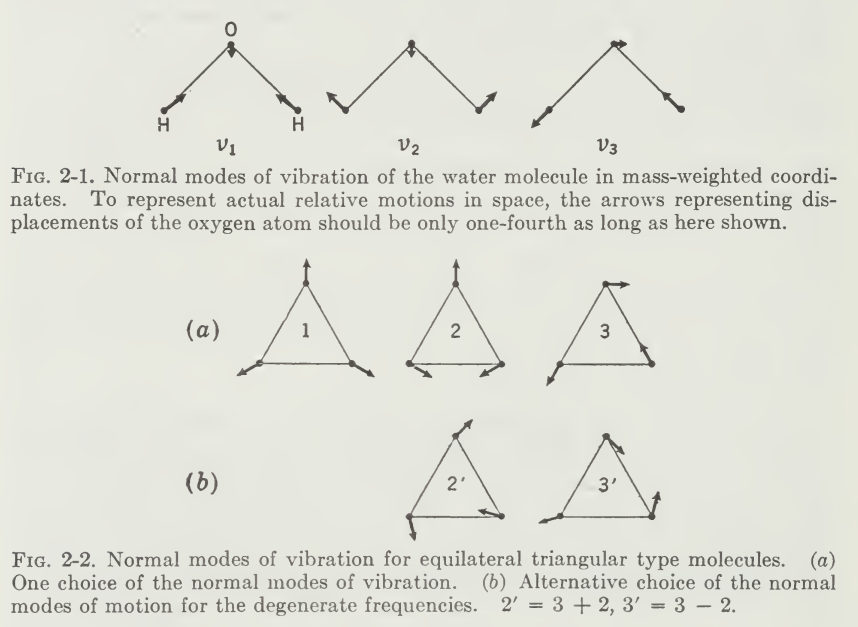{width=80%}

From this, we can see the theoretical consideration of the **selection rule** that will make different behaviours from appearing. There might be, in certain cases, that Raman or IR spectroscopy favourable in this area is attributed to certain normal mode of vibration and scattering effect in such range. Then, there would be the *scattering mode* and the *absorbing mode* of the molecular structure to be indicted. And usually, it is. 

Certain vibrational mode changes certain aspect of the **electronic configuration** of the atom. For example, certain configuration of molecular structure changes the *dipole moment* of the molecule. Such change induces the **IR-active** or **IR-inactive** criteria, because later on, as we should see, infrared spectroscopy relies on such dipole change for it to absorb with the spectra that we see. Raman on the other hand, uses the *electronic polarizability* to work, and this is enabled with a different kind of normal mode of vibration. 

::: {.callout-tip}

### Dipole moment and electric polarizability

Because of the scope of this document does not totally cover this aspect, we would like to 'quickly' review over the dipole moment, and the potential vibrational pattern it will exhibit, at least harmonically. For starter, let's think of them as **internal structure differences**.

In a molecule (typically), atoms can share electrons, but in an unequal sense. This creates the *dipole moment* of the molecule. This can happen if the structure of the electron makes it more *electronegative* than the other, causing it to pull more electron to its side. Here creates an imbalance, of which one is more *partially negative*, and one is *partially positive*. Take for example, $\mathrm{H}_{2}\mathrm{O}$. By the weird law of chemical configuration, hydrogen has less electronegativity (obviously) compared to oxygen. Hence, the dipole is more focused and of direction toward the oxygen itself. Generally, the dipole moment is a vector quantity, calculated using 

$$
\vec{\mu}= \sum_{i}q_{i}\vec{r}_{i} = \vec{\delta} \cdot d
$$
where $\vec{\mu}$ is the dipole moment vector, $q_{i}$ is the magnitude of the $i$th charge, and of the position vector $\vec{r}$ respectively. $\vec{\delta}, d$ are respectively the general expression for number of charge at either end, governs the direction, and the distance between them. 

{fig-cap-location="bottom"}

The **electric polarizability** however, refers to the type of displacement type behaviour of the electric cloud. Usually, this measures the *total influence that can be given* of a specific molecular structure, in changing their particular dipole per unit area measure over the presence of certain electromagnetic field or source [^19]. Base on the restriction of the electric field, usually, the dipole displacement can be, and could be, usually aligned with the system, and only change in the directional displacement instead. 

As such, usually, the vibrational mode, using reduced molecular instruction, would be something that distort the molecular dipole of the structure - so *bending*, *asymmetric stretching*, *symmetric stretching* (non-aligned structure), or *out-of-plane bend*. [^18]. The configuration of the system gives such displacement either IR or Raman active base on their intended effect, as predicted using models like VSEPR. 

[^18]: A short list can be found [here](https://www2.chem.wisc.edu/deptfiles/OrgLab/handouts/Simplified%20IR%20Correlation%20Chart.pdf)

:::

[^19]: See [this](https://link.springer.com/chapter/10.1007/978-1-4615-8984-6_1), [this](https://chem.libretexts.org/Bookshelves/Physical_and_Theoretical_Chemistry_Textbook_Maps/Supplemental_Modules_(Physical_and_Theoretical_Chemistry)/Physical_Properties_of_Matter/Atomic_and_Molecular_Properties/Dipole_Moments) and [this](https://www.lehigh.edu/imi/teched/GlassCSC/Lecture_5_Petit.pdf).

::: {.callout-important} 

### Classical interpretation alternatives (The Lorentz oscillator / Drude–Lorentz model) 

Such effect above can have a different way of deriving observations and behaviours. The classical view offers us another observation of electrical harmonic oscillation via using only the *Newtonian mechanical oscillation* model. Historically, this contains the synthesis based on Lorentz oscillator / Drude–Lorentz model, and Kubo mechanical derivation of the damped harmonic oscillator. [^16]

[^16]: Our main source is [here](https://chem.libretexts.org/Bookshelves/Physical_and_Theoretical_Chemistry_Textbook_Maps/Time_Dependent_Quantum_Mechanics_and_Spectroscopy_%28Tokmakoff%29/12%3A_Time-domain_Description_of_Spectroscopy/12.01%3A_A_Classical_Description_of_Spectroscopy), which take its historical foundation from Lorentz (1892), Drude (1893) and Kubo (1957).

::: 

Finally, we note of something important - the **general solution** of the vibrational system. If two modes of vibration having different frequencies are superimposed, the resulting motion would be of the form 

$$
q_{i} = \sum^{3N}_{k=1} l_{ik}K_{k}\cos{(\lambda_{k}^{1/2})+\epsilon_{k}}
$$
which has $6N$ arbitrary constants, the amplitudes $K_{k}$, and phase difference $\epsilon_{k}$. 

___

Based from the theory, we can say that classical treatment focus on the *oscillatory* interpretation, and thereby attribute the standard behaviours to *normal/non-normal vibrational modes* of harmonic/anharmonic oscillation or displacement. Of such, the theoretical (classical) treatment requires several concepts, such as **normal coordinate**, **anharmonicity**, **oscillatory degeneracy solution**, **superimposition** interpretation, and the development of explaining them in terms of a *selection rule*. We have to be very careful, though, because this is where classical and quantum mechanical interpretation clashes with each other. [^20]

[^20]: This remains a fact, more so because usually, quantum mechanical development came in two phase - either *classical mechanics with quantum flavour*, out to *fully developed quantum physics*.

Here, the selection rule is the *vibrational normal mode*. In quantum physics, this will be of two types - either quantum oscillatory mode, or, the picture of *vibrational energy transition*. 

### Harmonic oscillator

Another way to obtain such result of approximating the vibration model to be harmonic, is to, as we said above, analyze the Hooke linear system harmonic. A harmonic oscillator in this case can be defined as a mass point of mass $m$, which is acted upon by a force $F$ proportional to the distance $x$ from the equilibrium position and directed toward the equilibrium position, per usual. Hence, we have 

$$
F = - kx = m \frac{d^{2}x}{dt^{2}} \to x = x_{0}\sin{(\omega_{vib}(t)+\phi)}
$$
where $\omega_{vib}$ is the vibrational frequency, given by $\omega_{vib}=\sqrt{k/m}$, $x_{0}$ the amplitude of the vibration, and $\phi$ is the phase constant depending on the initial conditions. This aligns with our upper section. 

Since the force is the negative derivation of the potential energy $V$, hence the potential energy of the harmonic oscillator would be 

$$
F = - \frac{\partial V}{\partial x} = -kx \implies V = \frac{1}{2} kx^{2} = \frac{1}{2}m\omega^{2}_{vib}x^{2}
$$
From this, we can therefore define a harmonic oscillator as a system whose potential energy is proportional to the square of the distance from its equilibrium position, and is hence a parabola. 

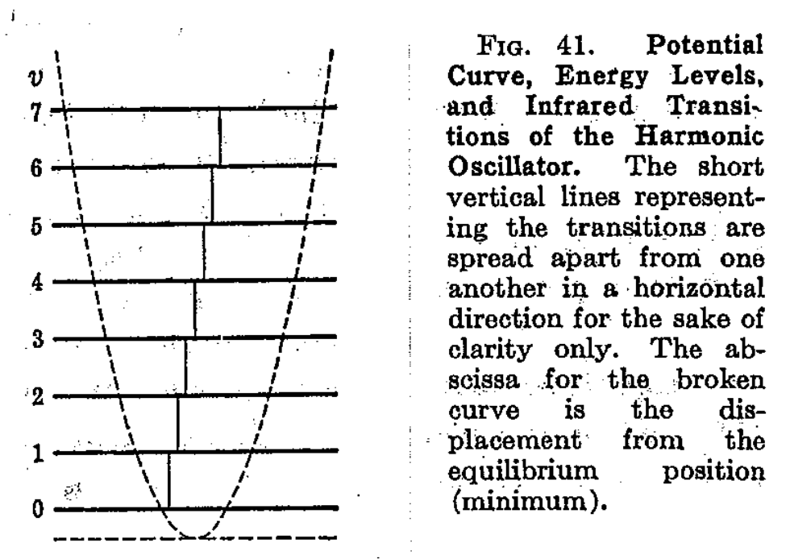

From such analysis, the conclusion is made, 

> The restoring force exerted by the two atoms of a molecule on each other when they are displaced from their equilibrium position is, at least approximately, proportional to the change of internuclear distance. If we assume that this relation holds exactly, it follows immediately that the atoms in the molecules will execute harmonic vibrations when they are left to themselves after being displaced from their equilibrium positions.

For the first atom with mass $m_{1}$ and of the second atom with mass $m_{2}$, 

$$
m_{1} \frac{d^{2}r_{1}}{dt^{2}} = -k (r-r_{e}), \quad m_{2} \frac{d^{2}r_{2}}{dt^{2}} = - (r-r_{e})
$$
where $r$ is the internuclear distance of the two atoms, and $r_{e}$ being the equilibrium internuclear distance, we can obtain 

$$
\frac{m_{1}m_{2}}{m_{1}+m_{2}} \frac{d^{2}r}{dt^2} = -k (r-r_{e})
$$
which is calculated into the following formula, using the reduced mass $\mu$:

$$
\mu \frac{d^{2}(r-r_{e})}{dt^{2}} = -k(r-r_{e}), \quad \mu = \frac{m_{1}m_{2}}{m_{1}+m_{2}}
$$
Which looks exactly the same as our derivation of the harmonic mode. This can then be extended to polyatomic structure, however there must be certain notions to explore and modify based on such structure. The classical vibrational frequency $\nu_{vib}$ of the molecule is then of 

$$
\nu_{vib} = \frac{\omega_{vib}}{2\pi} = \frac{1}{2\pi} \sqrt{\frac{k}{\mu}}
$$
In this particular model, only one vibrational frequency is possible, for the exchange of the amplitude being variation of any desired value. 

### Anharmonicity oscillator

Simple harmonic oscillator system (including later on the quantum harmonic system) does not predict, or take into account the *bond dissociation* of molecular structure. Due to the spacing assumption of the symmetric parabolic structure, all energy transitions occur at the same frequency, but experimentally, many line overtones compared to the uniform separation. This is encoded by what is then called the **anharmonicity oscillator curve**, or the **Morse curve**. 

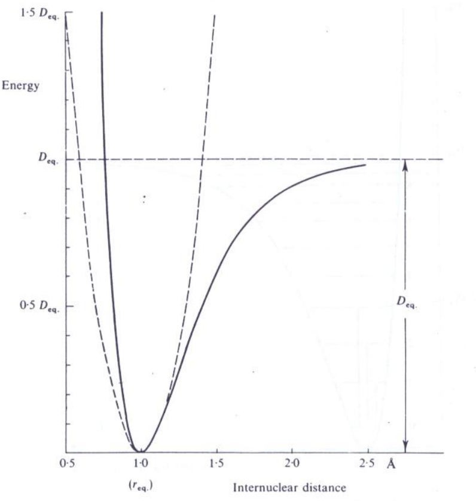{width=70%}

A purely empirical expression with fits this curve to a good approximation is derived by P. M. Morse (hence the name), and is called the *Morse function*: 

$$
E = D_{eq}\left[ 1 - \exp{a(r_{eq}-r)} \right]^{2} \approx 2\alpha D_{e}^{1/2} \left[ (n+1/2) - (n+1/2)^{2} \frac{\alpha}{2D_{e}^{1/2}}\right]
$$
where $a$ is a constant for a particular molecule and $D_{eq}$ is the dissociation energy. This curve works for both classical and quantum models. 

### Vibrations of Polyatomic Molecules

As with the previously discussed diatomic model, in diatomic molecules, vibration occurs only along the chemical bond connecting the nuclei [^21]. In polyatomic molecules, the situation is complicated because all the nuclei perform their own harmonic oscillations. However, we can show that any of these complicated vibrations of a molecule can be expressed as a superposition of a number of "normal vibrations" that are completely independent of each other. We can also then show why having the group frequency concept is detrimental for building and maintaining the scalability of measurements. 

[^21]: In case you are wondering. Yes, such stretching and swinging indeed creates variational dipole moment, especially for heterogenous diatomic molecule (take $\mathrm{HCL}$ or $\mathrm{CO}$) for example. 

Let us consider a mechanical model of the $\mathrm{CO}_{2}$ molecule. Here, the $C$ and the $O$ atoms are represented by the balls, weighing in proportion to their atomic weights. 

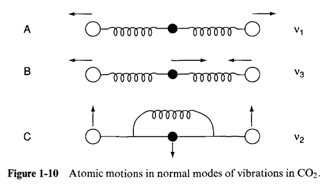{width=70%}

Suppose that the $C-O$ bonds are stretched and released simultaneously, as in A. Then, we call this type of vibration, which is a normal one the *symmetric (in-phase) stretching vibration*. The frequency of achieving this is $1,340\mathrm{cm}^{-1}$. In B, notice that we first shrink one side, stretch the other, and release them simultaneously. This is called the *antisymmetric (out-of-phase) stretching vibration*. Finally, we consider the case where three balls are moved in the perpendicular direction and released simultaneously in C. This is the third type, which is called the *symmetric bending vibration*. 

Since each atom can move in three directions, $(x,y,z)$, an $N$-atom molecule has $3N$ degree of freedom of motion. They also include six degrees of freedom from translational motions (three directions, three rotational motions). Thus, the net degree of motion is $3N-6$. In the case of linear molecules, it becomes $3N-5$ since the rotation does not exist. How specific it is for permutation of different vibrational modes there are is a fundamental question, and it is realized to be unlikely of having an analytical solution, only the approximated ones. 

For the scope of this essay, treatments of the normal vibrations will be described in a sufficient way, of designating "normal coordinates" $Q_{1},Q_{2},Q_{3}$ for the normal vibrations such as $v_{1},v_{2},v_{3}$ respectively. The relationship between a set of normal coordinates and a set of generalized coordinates in Cartesian form is given by 

$$
\begin{align*}
  q_{1} & = B_{11}Q_{1} + B_{12}Q_{2} + \dots \\
  q_{2} & = B_{21}Q_{1} + B_{22}Q_{2} + \dots
\end{align*}
$$
so that the modes of normal vibration can be expressed in terms of Cartesian coordinates if the $B_{ij}$ terms are calculated ([John R. Ferraro, Kazuo Nakamoto and Chris W. Brown, 2003](https://www.sciencedirect.com/book/9780122541056/introductory-raman-spectroscopy)).

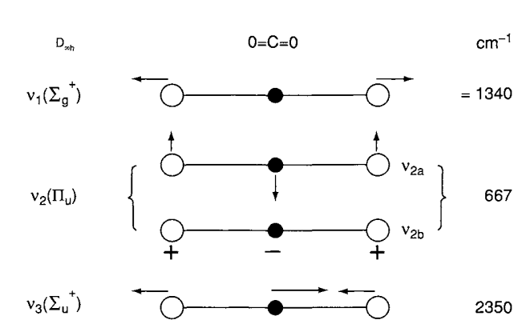{width=70%}

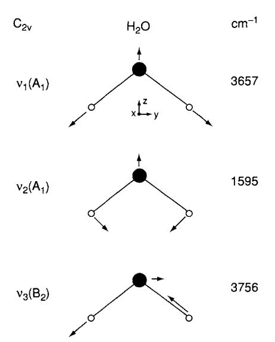{width=80%}

### The normal mode oscillation 

We will provide a classical analysis on normal mode oscillation. If we are lucky enough to cover this cleanly, I think it would be enough to justify of a possible approximation on how vibrational spectra will work, partially so to speak. Of course, this will not be sufficient for larger and more complex molecular structure. For such, we have to resort to group theory's aid to solve such problem more effectively so. 

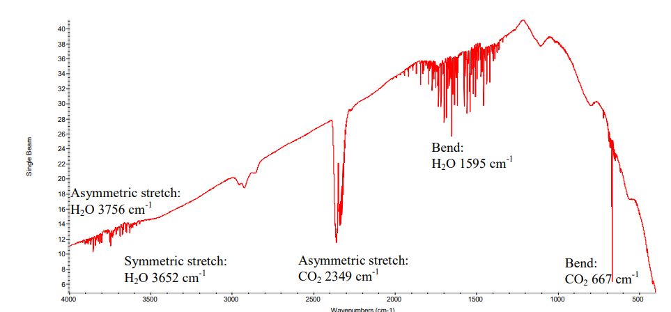{width=85%}

For a molecule the $(x,y,z)$ coordinates of each atom must be specified. The coordinates are denoted $(x_1, y_1, z_1)$ and so on. Extension of this notation to positions and equilibrium positions for that atom and we gain the matrix representation (for readability, please): 

$$
\begin{bmatrix}
  X_{1} & Y_{1}& Z_{1} & x_1 & y_1 &　z_1\\
  X_{2} & Y_{2}& Z_{2} & x_1 & y_1 &　z_1\\
  \vdots & \vdots & \vdots & \vdots & \vdots & \vdots \\
  X_{i} & Y_{i}& Z_{i} & x_1 & y_1 &　z_1
\end{bmatrix}
=
\begin{bmatrix}
  X_{1} & Y_{1}& Z_{1} & (X_{1}-X_{1,eq}) & (Y_{1}-Y_{1,eq}) &　Z_{1}-Z_{1,eq}\\
  X_{2} & Y_{2}& Z_{2} & (X_{2}-X_{2,eq}) & (Y_{2}-Y_{2,eq}) &　Z_{2}-Z_{2,eq}\\
  \vdots & \vdots & \vdots & \vdots & \vdots & \vdots \\
  X_{i} & Y_{i}& Z_{i} & (X_{i}-X_{i,eq}) & (Y_{i}-Y_{1,eq}) &　Z_{i}-Z_{1,eq}
\end{bmatrix}
$$
where $X_{i,eq}$ and the other coordinates respective descriptions are the equilibrium position from atom $i$. For example, if $x_1, y_1, z_1$ are all zero, then atom 1 is at its equilibrium position. Molecular mechanics or molecular orbital calculations are used to find the potential energy of the molecule as a function of the position of each atom, hence, 
$$
V(x_{1},y_{1},z_{1},x_{2},y_{2},z_{2},\dots,x_{N},y_{N},z_{N})
$$
is the correct expression for this. We can use the second derivative of the potential energy to calculate the force constants, by $k=d^{2}V/dt^{2}$ in the standard harmonic oscillator result. However, there are now $3N\times 3N$ possible second derivatives and their corresponding force constants. For example, 

$$
\frac{\partial^{2}V}{\partial x_{1}^{2}} = k_{xx}^{11}
$$
which is the change of the force on atom 1, in the $x$-direction when you move atom 1 in the $x$-direction. Similarly, 
$$
\frac{\partial^{2}V}{\partial x_{1}\partial y_{2}} = k_{xy}^{12}
$$
is the change of the force on atom 1 in the $x$-direction when you move atom 2 in the $y$-direction. For a diatomic consideration, we have the following table. 

| Expression                                                      | Notation      | Description                    |
| ------------- | ------------- | ------------------------------ |
| $\dfrac{\partial^2 V}{\partial x_1^2} = k_{xx}^{11}$            | $k_{xx}^{11}$ | same atom same direction       |
| $\dfrac{\partial^2 V}{\partial y_1^2} = k_{yy}^{11}$            | $k_{yy}^{11}$ | same atom same direction       |
| $\dfrac{\partial^2 V}{\partial x_1 \partial y_1} = k_{xy}^{11}$ | $k_{xy}^{11}$ | same atom different directions |
| $\dfrac{\partial^2 V}{\partial x_1 \partial x_2} = k_{xx}^{12}$ | $k_{xx}^{12}$ | different atom same direction  |
| $\dfrac{\partial^2 V}{\partial x_1 \partial y_2} = k_{xy}^{12}$ | $k_{xy}^{12}$ | different atom and direction   |

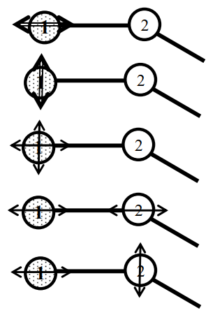{width=50%}

These force constants are not the force constants for individual bonds, they are force constants for the motion of a single atom subject to all its neighbours, whether directly bonded or not. The complete list of these force constants is called the **Hessian form matrix**, which is a $3N\times 3N$ matrix. It can be illustrated like the following long form, 

$$
4\pi^{2} \nu^{2}
\begin{bmatrix}
m_{1} & 0   & 0   &        &        &        \\
0   & m_{1} & 0   &        &        &        \\
0   & 0   & m_{1} &        &        &        \\
    &     &     & \ddots &        &        \\
    &     &     &        & m_{N} & 0      \\
    &     &     &        & 0     & m_{N}
\end{bmatrix}
\begin{bmatrix}
x_{1} \\ y_{1} \\ z_{1} \\
\vdots \\
x_{N} \\ y_{N} \\ z_{N}
\end{bmatrix}
=
\begin{bmatrix}
k_{xx}^{11} & k_{xy}^{11} & k_{xz}^{11} & k_{xx}^{12} & k_{xy}^{12} & \cdots & k_{xz}^{1N} \\
k_{yx}^{11} & k_{yy}^{11} & k_{yz}^{11} & k_{yx}^{12} & k_{yy}^{12} & \cdots & k_{yz}^{1N} \\
k_{zx}^{11} & k_{zy}^{11} & k_{zz}^{11} & k_{zx}^{12} & k_{zy}^{12} & \cdots & k_{zz}^{1N} \\
k_{xx}^{21} & k_{xy}^{21} & k_{xz}^{21} & k_{xx}^{22} & k_{xy}^{22} & \cdots & k_{xz}^{2N} \\
k_{yx}^{21} & k_{yy}^{21} & k_{yz}^{21} & k_{yx}^{22} & k_{yy}^{22} & \cdots & k_{yz}^{2N} \\
\vdots      & \vdots      & \vdots      & \vdots      & \vdots      & \ddots & \vdots      \\
k_{zx}^{N1} & k_{zy}^{N1} & k_{zz}^{N1} & k_{zx}^{N2} & k_{zy}^{N2} & \cdots & k_{zz}^{NN}
\end{bmatrix}
\begin{bmatrix}
x_{1} \\ y_{1} \\ z_{1} \\
\vdots \\
x_{N} \\ y_{N} \\ z_{N}
\end{bmatrix}
$$

where the right-hand sides of the above equation simply state that the total force on atom $i$ is the sum of the forces of all the atoms on atom $i$. In addition, we need $(x,y,z)$ triple for each of those force for each atom. Hence, there are total of $3N\times 3N$ terms. 

How can we use this to determine somewhat the normal mode of the system? Let us take an example on $\mathrm{CO}_{2}$, which is a good example of a symmetrical linear triatomic. 

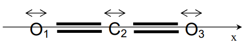

Because we have limited the vibrations to the x-axis, which is the internuclear axis, this model will provide the symmetric and asymmetric stretching modes, the general formula then reduces to  

$$
\begin{align}
  -4\pi^2 \nu^2 m_1 x_1 &= -k_{xx}^{11} x_1 - k_{xx}^{12} x_2 - k_{xx}^{13} x_3\\
-4\pi^2 \nu^2 m_2 x_2 &= -k_{xx}^{21} x_1 - k_{xx}^{22} x_2 - k_{xx}^{23} x_3\\
-4\pi^2 \nu^2 m_3 x_3 &= -k_{xx}^{31} x_1 - k_{xx}^{32} x_2 - k_{xx}^{33} x_3
\end{align}
$$

since we only need to keep the x-terms. Several numerical techniques are available to solve linear sets of simultaneous equations such as this. Conventionally, however, the problem is simplified by converting to mass weighted coordinates, for example:  

$$
\tilde{x}_1 = \sqrt{m_1}\, x_1 \quad\quad \tilde{x}_2 = \sqrt{m_2}\, x_2 \quad , \; \text{etc.}
$$

and mass weighted force constants:  

$$
\tilde{k}_{xx}^{12} = \frac{k_{xx}^{12}}{\sqrt{m_1}\sqrt{m_2}}
$$
In the new mass weighted coordinates, the equation becomes

$$
\begin{align}
  -4\pi^2 \nu^2 \tilde{x}_1 &= -\tilde{k}_{xx}^{11} \tilde{x}_1 - \tilde{k}_{xx}^{12} \tilde{x}_2 - \tilde{k}_{xx}^{13} \tilde{x}_3\\
  -4\pi^2 \nu^2 \tilde{x}_2 &= -\tilde{k}_{xx}^{21} \tilde{x}_1 - \tilde{k}_{xx}^{22} \tilde{x}_2 - \tilde{k}_{xx}^{23} \tilde{x}_3\\
  -4\pi^2 \nu^2 \tilde{x}_3 &= -\tilde{k}_{xx}^{31} \tilde{x}_1 - \tilde{k}_{xx}^{32} \tilde{x}_2 - \tilde{k}_{xx}^{33} \tilde{x}_3
\end{align}
$$

For example, we can show that the first equation is equivalent to the earlier one, by substituting the definitions:

$$
-4\pi^2 \nu^2 \sqrt{m_1}\, x_1 
= -\frac{k_{xx}^{11}}{\sqrt{m_1}\sqrt{m_1}} \sqrt{m_1}\, x_1 
   -\frac{k_{xx}^{12}}{\sqrt{m_1}\sqrt{m_2}} \sqrt{m_2}\, x_2 
   -\frac{k_{xx}^{13}}{\sqrt{m_1}\sqrt{m_3}} \sqrt{m_3}\, x_3
$$

Cancelling mass terms and multiplying both sides by $\sqrt{m_1}$ recovers the earlier form. The system is most easily written in the equivalent matrix form for readability (really so):

$$
-\begin{bmatrix}
\dfrac{k_{xx}^{11}}{\sqrt{m_1}\sqrt{m_1}} & \dfrac{k_{xx}^{12}}{\sqrt{m_1}\sqrt{m_2}} & \dfrac{k_{xx}^{13}}{\sqrt{m_1}\sqrt{m_3}} \\
\dfrac{k_{xx}^{21}}{\sqrt{m_2}\sqrt{m_1}} & \dfrac{k_{xx}^{22}}{\sqrt{m_2}\sqrt{m_2}} & \dfrac{k_{xx}^{23}}{\sqrt{m_2}\sqrt{m_3}} \\
\dfrac{k_{xx}^{31}}{\sqrt{m_3}\sqrt{m_1}} & \dfrac{k_{xx}^{32}}{\sqrt{m_3}\sqrt{m_2}} & \dfrac{k_{xx}^{33}}{\sqrt{m_3}\sqrt{m_3}}
\end{bmatrix}
\begin{bmatrix}
\tilde{x}_1 \\
\tilde{x}_2 \\
\tilde{x}_3
\end{bmatrix}
=
-4\pi^2 \nu^2
\begin{bmatrix}
\tilde{x}_1 \\
\tilde{x}_2 \\
\tilde{x}_3
\end{bmatrix}
$$

The mass weighted force constants give a symmetric matrix. In other words, the corresponding off diagonal elements are equal. The last equation is then a basic linear algebraical eigenvalue-eigenvector equation. The eigenvalues are the negative of the squared normal mode frequencies. The eigenvectors are the mass weighted normal coordinate displacements. The matrix of force constants is the matrix of the second derivative of the potential energy, or the Hessian. Energy minimization techniques also use this to minimize the energy of all the atoms in the molecule. 

Nevertheless, in a sense, such formulation is valid for the vibrational patterns of simple molecule. In essence, we now moved down from the geometrical interpretation and what not to have a solid formulation technique for solving this kind of problem, at least in classical sense. 

___

#### Electromagnetic field oscillation (classical Raman)

For Raman spectroscopy, one arguably good approximation can be achieved. Here, we use the effect of *electromagnetic radiation theory* to study such action. 

> According to the classical theory of electromagnetic radiation, electric and magnetic fields oscillating at a given frequency are able to give out electromagnetic radiation of the same frequency. One could use electromagnetic radiation theory to explain light scattering phenomena. [^15]

[^15]: See [here](https://chem.libretexts.org/Bookshelves/Physical_and_Theoretical_Chemistry_Textbook_Maps/Supplemental_Modules_%28Physical_and_Theoretical_Chemistry%29/Spectroscopy/Vibrational_Spectroscopy/Raman_Spectroscopy/Raman%3A_Theory). A lot of the full derivations in this section are also from here. For further classical treatment of Raman spectroscopy, including semi-classical, this [paper](https://inis.iaea.org/records/g198w-d6p74) is one particular example. 

For a lot of systems, we take only the induced electric dipole moment $\mu$ in the consideration. The dipole moment which is induced by the electric field $\mathbf{E}$ could be expressed by the power series

$$
\mu = \underbrace{\alpha \mathbf{E}}_{\mu^{(1)}} + \underbrace{\frac{1}{2} \beta \mathbf{E}\mathbf{E}}_{\mu^{(2)}} + \underbrace{\frac{1}{6} \gamma \mathbf{E}\mathbf{E}\mathbf{E}}_{\mu^{(3)}} + \dots
$$

for $\alpha$ being the polarizability tensor of second rank, unit of $\mathrm{CV}^{-1}m^{2}$, and so is for $\beta, \gamma$ and so on. According to such derivation, the contribution of the other terms, $\mu^{(2,3)}$ are small unless electric field is very high. One then might expect to explain the effect using $\mu^{(1)}$ only. 

Let us consider the interaction of a molecular system with the harmonically oscillating electric field of frequency $\omega_{0}$. By our analysis of small range coordinate manipulation, we consider rotation and vibration entirely independent. Hence, as we indicted of Raman being dependent on the polarizability, it will be a function of the nuclear coordinates, expressed of the variation of such polarizability tensor with vibrational coordinates as 

$$
\alpha_{ij} =\left (\alpha_{ij} \right )_{0} +\sum_{k} \left (\frac{\partial \alpha_{ij} }{\partial Q_{k}} \right )_{0}Q_{k}+\frac{1}{2}\sum_{k,l}\left (\frac{\partial^2 \alpha_{ij}}{\partial Q_{k}\partial Q_{l}} \right )_{0}Q_{k}Q_{l}+\cdots
$$

where $(\alpha_{ij})_{0}$ is the $\alpha_{ij}$ value at the equilibrium configuration, $Q_{k},Q_{l}$ are normal coordinates of respective vibrational frequencies. From this, an approximation to harmonic oscillation can be made. Fixing to $Q_{k}$, we have 

$$
\alpha_{ij} =\left (\alpha_{ij} \right )_{0} +\left (\frac{\partial \alpha_{ij} }{\partial Q_{k}} \right )_{0}Q_{k}, \quad Q_{k}=Q_{k0} \cos \left ( \omega_k t + \delta _k \right )
$$

The expression of the $\alpha$=tensor resulting from the $k$th order vibration is 

$$
\mathbf{\alpha}_{k}=\mathbf{\alpha }_{0}+\left (\frac{\partial \mathbf{\alpha}_{k}}{\partial Q_{k}} \right )_{0}Q_{k0}\cos\left (\omega_{k} t+\delta _{k} \right )
$$

Now, under the influence of electromagnetic radiation at frequency $\omega_{0}$, the induced electric dipole moment $\mu$ is expressed as 

$$
\begin{align}
  \mu^{(1)} &= \mathbf{\alpha}_{0}\cdot \mathbf{E}_{0}\cos\omega_{0} t+\dfrac{1}{2}\left (\frac{\partial \mathbf{\alpha}_{k}}{\partial Q_{k}} \right )_{0}\cdot \mathbf{E}_{0}Q_{k0}\cos\left (\omega_{0} t+\omega_{k} t+\delta_k \right )\\
  & \quad \quad + \dfrac{1}{2}\left (\dfrac{\partial \mathbf{\alpha}_{k}}{\partial Q_{k}} \right )_{0}\cdot \mathbf{E}_0 Q_{k0}\cos\left (\omega_{0}t-\omega_{k} t-\delta_{k} \right )
\end{align}
$$

We see that the linear induced dipole moment $\mu^{(1)}$ has three components with different frequencies, $\alpha_{0}\cdot \mathbf{E}\cos{(\omega_{0}t)}$ which gives to Rayleigh scattering, the second term being anti-Stokes Raman scattering of $\omega_{0}+\omega_{k}$ scattering, and the final term is the radiation of the Stoke Raman scattering with frequency $\omega_{0}-\omega_{k}$. 

### Quantum theory

TBH. Please help. 

# Further reading 

- Peter F. Bernath — *Spectra of Atoms and Molecules* (not recommend somehow)

- [Gerhard Herzberg — *Molecular Spectra and Molecular Structure*](https://archive.org/details/molecularspectra032774mbp) 

- [Walter Gordy & Robert L. Cook — *Microwave Molecular Spectra*](https://archive.org/details/microwavemolecul0000gord)

- [C. H. Townes & A. L. Schawlow — *Microwave Spectroscopy*](https://store.doverpublications.com/products/9780486162317)

- [MIT OpenCourseWare — *5.80 Small-Molecule Spectroscopy and Dynamics* — lecture notes & supplements](https://ocw.mit.edu/courses/5-80-small-molecule-spectroscopy-and-dynamics-fall-2008/pages/lecture-notes/) 

- [ETH Zürich — *Fundamentals of Rotation–Vibration Spectra*](https://www.ir.ethz.ch/handbook/MQ332_Albert%20Keppler%20Albert%20Hollenstein%20et%20al%20Bearbeitet.pdf) 

- [NIST — Molecular Microwave / Rotational Spectral Databases](https://www.nist.gov/pml/molecular-microwave-spectral-databases) 

- [CDMS (Cologne Database for Molecular Spectroscopy)](https://cdms.astro.uni-koeln.de/) 

- [HITRAN — high-resolution molecular spectroscopic database and documentation](https://hitran.org/)   
  
[^1]: See [this post](https://physics.stackexchange.com/questions/667944/does-a-single-atom-vibrate), which also discusses the mechanics of single-atom vibration. The link also gives an explanation that the interpretation of quantum mechanics, as well as observations, permits vibration in the sense of probability fluctuation, but not actually phonon. However, it is actually is the molecular vibration of the atom itself, that correlates, in the single atom case, to phonon modes - which is the vibrational mechanics of many-atom case. However, in such case, the vibration system is so small, plus their cause is now not molecular bonding and electronic structure, but rather the atomic structure between subparticles (so, something like [this](https://physics.stackexchange.com/questions/184243/is-molecular-vibration-just-phonon-modes-for-a-single-molecule))

# Appendix

## Independent of vibration and rotation (classical)

Within the framework of classical physics, we can separate the rotational state and vibrational state of the system into two different, independent effects. That is to say we want to have each one, rotational and vibrational factor of a given molecular structure to be attributed differently, of different phenomena, and are entirely independent of each other. This approximation works well to marginally fit the quantum system, with proper coordinates. 

Let $x_{a},y_{a},z_{a}$ be the coordinates of the $\alpha$th atom in terms of the moving system, $a_{\alpha},b_{\alpha},c_{\alpha}$ be the values of the coordinates of the equilibrium position of the $\alpha$th atom, assumed by $x_{a},y_{a},z_{a}$ at rest. The displacement from equilibrium would be just

$$
\Delta x_{\alpha} = x_{\alpha} - a_{\alpha}, \Delta y_{\alpha} = y_{\alpha} - b_{\alpha}, \Delta z_{\alpha} = z_{\alpha} - c_{\alpha}
$$

The condition that the origin be at the centre of mass yields the equations 

$$
\sum^{N}_{\alpha=1} m_{\alpha}x_{\alpha} = 0,\:\: \sum^{N}_{\alpha=1} m_{\alpha}y_{\alpha} = 0, \:\:\sum^{N}_{\alpha=1} m_{\alpha}z_{\alpha} = 0
$$

in which $m_{\alpha}$ is the mass of the $\alpha$th atom. Similar expressions must hold for the equilibrium configuration. Consequently, 

$$
\sum^{N}_{\alpha=1} m_{\alpha}\Delta x_{\alpha} = 0,\:\: \sum^{N}_{\alpha=1} m_{\alpha}\Delta y_{\alpha} = 0, \:\:\sum^{N}_{\alpha=1} m_{\alpha}\Delta z_{\alpha} = 0
$$

The angular momentum, with certainly some assumptions of the moving system, give the angular momentum of the moving system as 

$$
\mathfrak{m}_x = \sum_{\alpha=1}^{N} m_{\alpha} \left( y_{\alpha} \dot{z}_{\alpha} - z_{\alpha} \dot{y}_{\alpha} \right)
$$

$$
\mathfrak{m}_y = \sum_{\alpha=1}^{N} m_{\alpha} \left( z_{\alpha} \dot{x}_{\alpha} - x_{\alpha} \dot{z}_{\alpha} \right)
$$

$$
\mathfrak{m}_z = \sum_{\alpha=1}^{N} m_{\alpha} \left( x_{\alpha} \dot{y}_{\alpha} - y_{\alpha} \dot{x}_{\alpha} \right)
$$

Under such circumstances, the time derivative can give infinitesimal result just as $a_{\alpha},...$ and so on. Hence, we have 

$$
\mathfrak{m}_x \cong \sum_{\alpha=1}^{N} m_{\alpha} \left( b_{\alpha} \dot{z}_{\alpha} - c_{\alpha} \dot{y}_{\alpha} \right)
$$

$$
\mathfrak{m}_y \cong \sum_{\alpha=1}^{N} m_{\alpha} \left( c_{\alpha} \dot{x}_{\alpha} - a_{\alpha} \dot{z}_{\alpha} \right)
$$

$$
\mathfrak{m}_z \cong \sum_{\alpha=1}^{N} m_{\alpha} \left( a_{\alpha} \dot{y}_{\alpha} - b_{\alpha} \dot{x}_{\alpha} \right)
$$
The conditions actually employed in defining the rotating coordinate system are 
$$
\sum_{\alpha=1}^{N} m_{\alpha} \left( b_{\alpha} \Delta z_{\alpha} - c_{\alpha} \Delta y_{\alpha} \right) = 0
$$
$$
\sum_{\alpha=1}^{N} m_{\alpha} \left( c_{\alpha} \Delta x_{\alpha} - a_{\alpha} \Delta z_{\alpha} \right) = 0
$$

and 

$$
\sum_{\alpha=1}^{N} m_{\alpha} \left( a_{\alpha} \Delta y_{\alpha} - b_{\alpha} \Delta x_{\alpha} \right) = 0
$$

If differentiated with respective time, it is seen that they become equivalent to the equation obtained when the approximate expressions for momentum in $(x,y,z)$ are equated to zero, since we have 

$$
\left( \frac{d \Delta x_{\alpha}}{dt} \right) = \dot{x}_{\alpha}
$$

From such, we can then conclude that the problem of vibration of a molecule may be treated independently of its rotation by using a system of coordinates moving with the molecule, and satisfying such constrains, which is usually practical. 