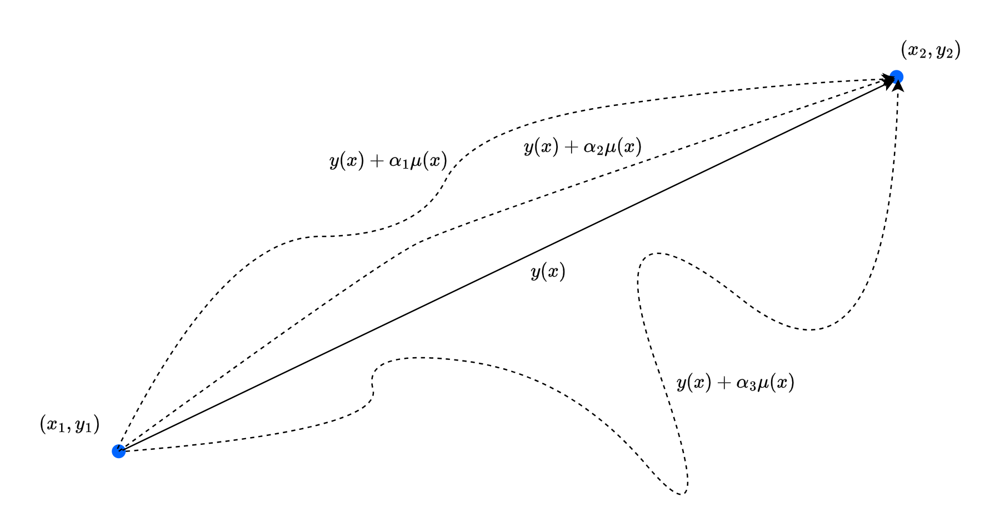

At some point after learning all the basic of Newtonian formalism of physical law, one may want to apply it to real world problem. This is no big deal, as far as we are concerned of... Unless, one wants to apply it to higher, more complex system. At that point, the problem become not so trivial. Not so trivial how, well, later on we will see. For now, we only have to know that a fine gentleman named Joseph-Louis Lagrange (ジョゼフ＝ルイ・ラグランジュ), gave us the more likely approach to mechanics - the **Lagrangian mechanics**. 

> There are two ways to see mechanics and its principles. The first one is by considering it as a theory of forces, the causes that impress motion. The second is by considering it as a theory of motions themselves. (Lazare Carnot, 1803)

# Calculus of variation
It seems like a tradition - that every course of Lagrangian mechanics and beyond (Hamiltonian mechanics) begins with the discussion of the **calculus of variation**[^1]. So, per tradition, we will also begin with such. It is to noticed, for the one who just started learning about Lagrangian mechanics that it will seem so unncessary. But, later on, perhaps one's perspective will change. 

## Shortest path between two points
Given two points $(x_{1}, y_{1})$ and $(x_{2}, y_{2})$, what is the shortest path between them, given by a path $y=y(x)$? Assuming the space is continuous (so do Euclid's favour), then we might say that the shortest path is the straight line. But how do we formulate such? 

We can indeed calculate the length of the path by using the arc length, which gives us: 
$$
L(1,2) = \int_{1}^{2} \: ds = \int_{x_{1}}^{x_{2}} \sqrt{1+y'(x)^{2}} \: dx
$$
This is applicable for all path functional $y(x)$ that gives us the desired path. If we want to somehow prove that the shortest path is indeed straight, then we will have to find if the straight formulation is indeed the *minimum* in such case. Do remember however, that the minimum of an integral, is not taking it to be zero area. Rather, it is to prove that the length is wised enough to be straight. We are finding a function, and having to make it to be straight - which will satisfy our problem statement. You can think of the integral as being bounded below by the minimum, if that makes sense. If that does not help, then imagine this: that function $\sqrt{1+y'(x)^{2}}$ is not going to be zero. But you can fine the minimum of it regardless of any addition form $\mu(x)$ added on top. 

The problem that we are facing is interestingly interpretable as the problem of finding the **stationary point** - the point where if you wiggle around a bit, nothing will particularly change of the state of the system. Our concern is hence how the infinitesimal variations of a path change an integral - in which perhaps we want it to... not move that much? For such reason, comes the title of this section being calculus of variations. 

## The Euler-Lagrange Equation

We can rewrite the integral as 
$$
S= \int_{x_{1}}^{x_{2}} f[y(x),y'(x),x]\: dx
$$
where $y(x)$ is the unknown curve joining two points 1 and 2. We have the condition that $y(x_1) = y_1$, and $y(x_2)=y_2$ for such reason. How about the wrong version? The class of all wrong curves can be defined to be $Y(x)$ of the additional length term, $\eta(x)$ [^2]. The formulation is hence
$$
Y(x) = y(x) + \alpha \eta (x) , \quad \eta: \mathbb{R}^{n} \to \mathbb{R}
$$
If the factor $\alpha=0$, we get the original curve. If not, we get the wrong curve, ideally for $\alpha =1$. Unfortunately, this formation will be dependent of the difference function $\eta$, since it is strictly restricted to the linearity expression $\alpha \eta(x)$. Nevertheless, we have that $\eta(x_1)=\eta(x_2)=0$, to satisfies the endpoint requirement of a path. 

From our formulation, we imply that the right curve is found at $\alpha = 0$, or rather, the stationary state is achieved at such point, for the integral, now called $S(\alpha)$. We have converted our problem to the traditional problem of making sure that an ordinary function $S(\alpha)$ has a minimum at a specified point. To do this, we again, take the derivative. 
$$
\begin{split}
S(\alpha) & = \int_{x_{1}}^{x_{2}} f(Y,Y',x)\: dx\\
& = \int_{x_{1}}^{x_{2}} f(y+\alpha \eta, y'+\alpha \eta', x)\: dx\\
\end{split}
$$
From this, 
$$
\frac{dS}{d\alpha} = \int_{x_{1}}^{x_{2}} \frac{\partial f}{\partial \alpha} \: dx = \int_{x_{1}}^{x_{2}} \left( \eta \frac{\partial f}{\partial y} + \eta \frac{\partial f}{\partial y'} \right)\: dx 
$$
which is derived of the chain rule. Now we need this integral to be zero, that is: 
$$
\int_{x_{1}}^{x_{2}} \left( \eta \frac{\partial f}{\partial y} + \eta \frac{\partial f}{\partial y'} \right)\: dx =0
$$
This condition must hold for any $\eta(x)$ satisfying the requirement only, for any choice of the wrong path. The integral can be simplified to [^3]
$$
\int_{x_{1}}^{x_{2}} \eta(x) \frac{\partial f}{\partial y'} \: dx = - \int_{x_{1}}^{x_{2}} -\eta(x)\frac{d}{dx}\left( \frac{\partial f}{\partial y'} \right) \: dx 
$$

Substituting this in, the original equation, we gain: 

$$
\int_{x_{1}}^{x_{2}} \eta(x) \frac{\partial f}{\partial y'} \: dx = - \int_{x_{1}}^{x_{2}} -\eta(x)\frac{d}{dx}\left( \frac{\partial f}{\partial y'} \right) \: dx 
$$

Substituting this into the equation above, we get 
$$\int _{x_{1}}^{x_{2}} \eta(x) \left( \frac{\partial f}{\partial y} - \frac{d}{dx} \frac{\partial f}{\partial y'} \right) \, dx = 0 $$

This condition must be satisfied for any choice of the function $\eta(x)$. Therefore, the factor in the large parentheses must be zero, that is: 

$$\frac{\partial f}{\partial y}- \frac{d}{dx} \frac{\partial f}{\partial y'} = 0$$

This is called the **Euler-Lagrange equation**, for all $x$ in the interval $[x_{1},x_{2}]$. This equation of Leonhard Euler and Joseph Lagrange lets us find the path for which the integral $S$ is stationary. It is applicable for, again, any small arbitrary variation $\eta(x)$, either negative or positive sign (by curvature). We have the following lemma for such.

::: {#thm-Usefullemma}
### Useful lemma
If $\alpha(x)$ is continuous in $[a,b]$ and: 
$$
\int_{a}^{b} \alpha (x) \eta (x) \: dx = 0
$$
for all continuously differentiable functions $\eta(x)$ which satisfy $\eta(a)=\eta(b)=0$, then $\alpha(x)\equiv 0$ in $[a,b]$. 
:::

### Mathematical proof of the Euler-Lagrange equation
If you wonder that there is the formal proof of Euler-Lagrange equation... Well, there is. In such case, we can treat the problem simply as the olde optimization problem, of all priori. 

The analogous optimization problem from our rough physical implied formulation is as followed. Let $F(\alpha, \beta, \gamma)$ be a function with continuous first and second partial derivatives with respect to $(\alpha, \beta, \gamma)$. Then find $x\in C^{1}[a,b]$ such that $x(a)=y_{a}$ and $x(y)=y_{b}$, and which is an extremum for the function 
$$
I(x) = \int_{a}^{b} F[x(t),x'(t),t]\: dt
$$
In other word, for now, the optimization consists of finding an extremum of a function of the form above, for $\alpha = x(t)$, with $\beta = dx/dt$, and $\gamma = t$, or a *parameterized function* of the class of all admissible curves, all smooth curves joining two *fixed point* - the point 1 and 2 of the path.  

::: {#thm-lagrangemath}
### Euler-Lagrange formulation
Let $S=\{ x\in C^{1}[a,b]\mid x(a) = y_{a}\land x(b)=y_{b} \}$, and let $I:S\to \mathbb{R}$ be a function of the form 
$$
I(x) = \int_{a}^{b} F[x(t),x'(t),t]\: dt
$$
If $I$ has an extremum at $x_{0}\in S$, then $x_{0}$ satisfies the Euler-Lagrange equation: 
$$
\frac{\partial F}{\partial \alpha} (x_{0}(t), x_{0}'(t),t') - \frac{d}{dt} \left( \frac{\partial F}{\partial \beta} (x_{0}(t),x_{0}'(t),t) \right) = 0
$$
for $t\in [a,b]$

:::

Under this scope, we can gain several results directly. The derivation is generally long, but we will leave it to well, already available source. [^4]

## Generalized coordinates

So far, aside from the certainly weird formulation above, we have considered only problems with two variables, the indpendent variable $x$ and the dependent $y$. However, in a given mechanical system, sometimes we have more than such few variables. For most application, even, we would be better off with a system being dependent on the variable of time, $t$. 

If, for such formulation to be possible, and our principle of finding the shortest path to be able to be conducted within Euler-Lagrange equation, then we will be expected to include in our analysis **all paths possible** from 1 to 2, to even guarantee it being the shortest path. A lot of time, of course, we cannot write a path in the form $y=y(x)$ as we have done previously. If we want to be perfectly sure that we have found the shortest path among *all* possible paths, we must then find a method that includes these. The way to do this, is to write the path in parametric form as: 
$$
x=x(u), \quad y=y(u)
$$
where $u$ is any convenient variable in terms of which the curve can be parameterized. So, if we use this in a path, the length of a small segment of the path is 
$$
ds = \sqrt{dx^2 + dy^2 } = \sqrt{x'(u)^2 + y'(u)^2 }\: du
$$
Thus, the total path length is 
$$
L = \int_{u_1}^{u_2} \sqrt{x'(u)^2 + y'(u)^{2}} \: du
$$
and our job is then to find the two functions $x(u)$ and $y(u)$ for which this integral is minimum. While this is much more complicated, and instead of just $\alpha = 0$, we might need to have two, or three, $\alpha, \beta, \gamma...$ in the conditions, the Euler-Lagrange equations will only *increase in number*, that is, there are now two Euler-Lagrange equations: 
$$
\frac{\partial f}{\partial x} = \frac{d}{du} \frac{\partial f}{\partial x'}, \quad \frac{\partial f}{\partial y} = \frac{d}{du} \frac{\partial f}{\partial y'}
$$
These two equations will then determine a path for which the integral is stationary. The generalization into an arbitrary number of dependent variables is then straightforward. 

In Lagrangian mechanics, the independent variable is the time $t$. Hence, all other quantities can be expressed as $q(t)$, for a given time dependence. The dependent variables are the coordinates that specify the position, or "configuration" of a system, and are usually denoted by $q_1, q_2,\dots,q_n$, where $n$ denotes the number of coordinates, which depends on the nature of the system. For example, if the system is a double pendulum, then the degree of freedom is two, and those variables will be the two angles of deviation, $\theta_1, \theta_2$ (we will see about this later). 

Because the coordinates can take on so many guises, they are often referred to as **generalized coordinates**. It is often helpful to think that $n$ generalized coordinates as defining a point in a $n$-dimensional **configuration space**, each of whose points labels in a unique position, or configuration, of the system. It is also analogous to the **phase space** of a mechanical system, albeit comparing to a Newtonian phase space, they are quite different - in a good way. 

### Degrees of freedom
The number of degrees of freedom determines how many generalized coordinates are in Lagrangian mechanics. Usually, the good way to calculate them is as followed. 

Defining the dimension of the configuration space as the *degrees of freedom*, we then: 

1. Determine the number of coordinate components (Cartesian, polar, spherical, etc.) for each component of the dynamical system (for example, the double pendulum is then the two masses). This is denoted by $kN$, where $k$ is the component of the coordiate system, and $N$ is the amount of objects. 
2. Determine the constraint of the system, or the relational quantities - for example, the length of the stick between the two pendulum. This is denoted by $m$.
3. Calculate the degrees of freedom - the freely movable and dynamical part, as $n = kN - m$.

By such, we can get a somewhat perfect representation of the degree of freedom of a system. 

# The Lagrangian Mechanics

The Lagrangian of classical mechanics depends on several notions. From the get-go, maybe this is realizable because we have been building up the calculus of variation technique. 

For a system, there exists its **phase space**, or the space of all possible configuration state that the system can be at a given time or indicent. For example, the uniform circular motion will have the phase space as exactly the circle - as its evolution in time is subjected to position on the circle of radius $r$. By this, we can classify system based on how the phase space varies with time. If the phase space stays the same throughout its evolution in time, then we say the system is **conservative**. Else, if the system's phase space varies with time, then we call it **nonconservative**; in more detailed terms, we have **dissipative system** for system with reduced phase space, and **expanding system** for system with its phase space increased. 

Newtonian mechanics is fully sufficient practically for interpreting and analysing mechanical system and behaviours. Indeed, sometimes with all the laws and $\vec{F}=m\vec{a}$, it is enough to specifies all the evolution and factors of the system. However, with increasingly complex system, Newtonian formalism becomes much more difficult to work on, as its basis of specifying forces and additives of system's components together. Instead, it is desirable to find a way to obtain equations of motion from some scalar generating function, or rather, some inherent qualities that encode information about the system into itself, and can be used to defer to the equation of motion, which is, of importance is the evolutionary law of any given system based on mechanics. For conservative systems, the complete information about the system is contained in the total energy: 
$$
E= E_{k} + U
$$
This is expressed by a function of coordinates and velocities, or angles and their time derivatives for some system considered above. However, using this, there is no way to obtain equations of motion from the energy function directly. This can be deferred to the loss of information in the reversing direction, for the given mathematical realization of the physical system backward. It turns out, however, that the generating function of equations of motion is the quantity called **the Lagrangian** (or *Lagrange function*), taken in the form 
$$
\mathcal{L} = E_{k} - U = T- U
$$
The Lagrange formalism is build upon the so-called **Least-Action principle**, also called the **Hamiltonian principle**. According to this principle, that can be put into the foundation of mechanics, the actual dynamics of the system, that is, the actual time dependence of its *generalized coordinates* $\{q_{i}(t)\}$ minimize the action on the way from state 1 to state 2, that is the action path that the system choose will always be the minimal path, such that 
$$
\mathcal{S} = \int_{t_1}^{t_2} \mathcal{L}(q(t),\dot{q}(t),t) \: dt , \quad q\equiv \{q_{i}\}
$$
is minimum, hence must satisfy the Euler-Lagrange equation. One of such is the shortest path problem we have encountered in our example of the calculus of variation. Up to now, want can then ask about the reason why Lagrangian mechanics depends on the Hamiltonian principle (or why it is formulated as such). If we are to see the Lagrangian $\mathcal{L}$ as a somewhat energy functional of the system, then we can then interpret the integral $\mathcal{S}$ as the total effect of such energy function has on the given system, assuming that all information has been proxied by the energy functional of Lagrangian. Then, Hamiltonian's principle only states that the path that they take - or the real world takes, will be the one where the action is the least possible. This might not be clear for now, and surely it is for me, but perhaps it can be there to be dedicated in another post. 

Some properties we can cite for the Lagrangian can be then conducted, which will be helpful in formalising the consequences of the Lagrangian formulation. First, the Lagrangian is independent of space and time. That is, the Lagrangian at this position, and at that position, as long as it is the same system, will not change. And secondly, it also does not depend on the direction of the system. This is all because we are indeed, still treating the Lagrangian in an **inertial reference frame**. Intrinsic of the Lagrangian, on the other hand, includes the property of a **stationary point** - subtle variations of the system won't change the Lagrangian by much of its least action; and secondly, it posesses the linearity property, that is, $\mathcal{L}=\mathcal{L}_{1}+\mathcal{L}_{2}$, for all Lagrangians of interest. We will see how this is done in the latter sections. 

## Lagrangian of free mass (unconstrained motion)

Consider a particle moving unconstrained in three dimensions. They are not subjected to anything (short of a potential). Then, the Lagrangian $\mathcal{L}$ can be said to only be determined on the kinetic energy $T$ of the particle. That is, $\mathcal{L}=T$. So, how do we solve this particular problem? 

Because the Lagrangian depends on the kinetic energy, apparently, it means it, *perhaps* depends on the velocity of the particle. But we remember that the Lagrangian is equivalent for all direction - which makes the velocity being independent of the Lagrangian. Except for the magnitude. We then can say that the Lagrangian depends on $v^{2}$, of the squared magnitude of the velocity. That is, $\mathcal{L}(v^2)$. This dependency can then be expressed as 
$$
\mathcal{L}(v^{2}) = av^2
$$
where $a$ is an arbitrary constant. If we based off ourselves with the Galilee transformation, this choice also makes sense, because with this choice, the transformation of the Lagrangian from an inertial frame to another inertial frame, it will stay the same or at least with very small deviation (I will write about this later, please). 

For $a$, usually, we take it as $m/2$. It is also pretty evidential, somewhat, because we said that it only have kinetic energy. Then the Lagrangian is formulated by: 
$$
\mathcal{L} = T = \frac{1}{2}m \dot{\vec{r}}^{2} = \frac{1}{2} m (\dot{x}^2 + \dot{y}^{2}+ \dot{z}^{2})
$$
for a 3-dimensional system in the Cartesian coordinates. If we only take the foremost expression, and apply it to the Euler-Lagrange equation, it gives 
$$
\frac{d}{dt} m\vec{v} = 0
$$
which is indeed $m\vec{a}=0$. This fits the description of a free particle in an inertial frame. For spherical coordinate, you can express it as: 
$$
\mathcal{L} = \frac{m}{2} (\dot{r}^{2} + r^2 \dot{\varphi}^{2} + \dot{z}^{2})
$$
And in the spherical coordinate: 
$$
\mathcal{L} = \frac{m}{2} (\dot{r}^{2} + r^2 \dot{\theta}^{2} + r^2 \sin{\theta}^{2}\varphi^{2})
$$
If you get it a potential $U(r)$, the Lagrangian will only change by (given the Cartesian coordinates): 
$$
\mathcal{L} = \frac{1}{2} m (\dot{x}^2 + \dot{y}^{2}+ \dot{z}^{2}) + U(x,y,z)
$$

## Scaling up to multi-particles
For an interacting system of multiple particles, we can then get the expression to be enumerated: 
$$
\mathcal{L} = \sum_{i=1}^{n} \frac{1}{2}m_{i} v_{i}^{2} - U(x_1, y_1, z_1, \dots , x_n, y_n, z_n)
$$

[^3]: This comes from the derivation of the integration by part, for the endpoint already eliminated the first term, hence. 

[^2]: Last time, we used $\mu(x)$. Now, we kinda... switch the notation a bit. 

[^1]: Well, it is in fact, not coincidental. Another name of Lagrangian mechanics is called the *variational physics*. 

[^4]: See [This sources on the Euler-Lagrange formulation](https://mathsci.kaist.ac.kr/~nipl/am621/lecturenotes/Euler-Lagrange_equation.pdf). Generally, they use the linear space, and prove them using combinations of Taylor's theorem and partial derivative decompositions. 